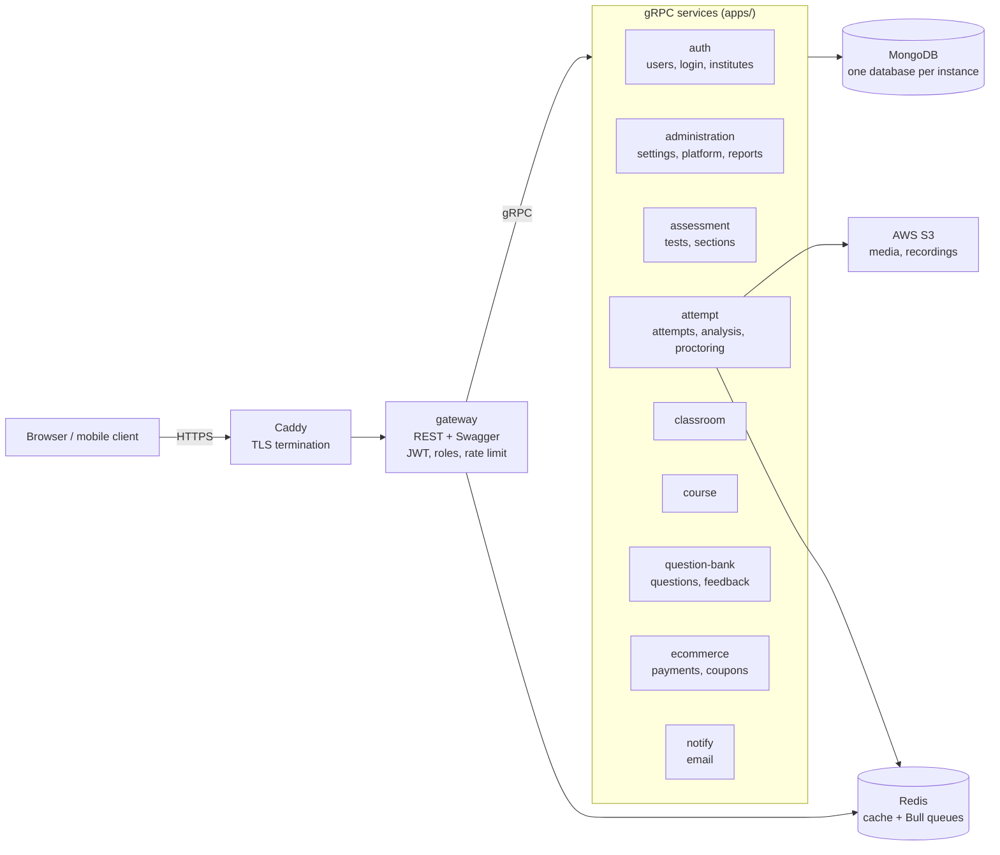
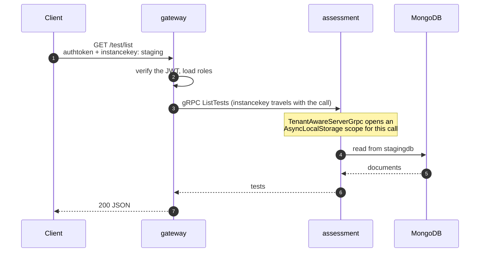

# NestJS Assessment Platform

[](https://github.com/ashfaque-work/nestjs-assessment-platform/actions/workflows/ci.yml)

Backend for an online assessment and learning platform (tests, question bank, classrooms, courses, proctoring, e-commerce), built as a **NestJS microservices monorepo**.

## Live demo

**[assess.ashfaqueahmad.com/api](https://assess.ashfaqueahmad.com/api)** — Swagger UI for the running API.

All 10 services, MongoDB and Redis run in Docker on a single 2-core ARM VM.

To call a protected endpoint:

1. `POST /auth/login` with the header `instancekey: staging` and body
   `{ "userId": "demo-student@example.com", "password": "DmnTAiBaXDSPM4#7a" }`
2. Send the returned token as the `authtoken` header, together with `instancekey: staging`.

The demo holds sample data only, and is reset from time to time.

## Architecture

One public HTTP service in front of nine gRPC services. Only the gateway is reachable from
the internet; the services talk to each other over gRPC on a private Docker network.



Every RPC carries the caller's `instancekey`, which decides the database the repositories read:



A second concurrent request for another instance runs in its own scope, so the two never
share the key.

| Path | What it is |
|---|---|
| `apps/gateway` | Public HTTP API. Validates the JWT, checks roles, forwards calls to services over gRPC |
| `apps/<service>` | gRPC microservices, one per domain |
| `apps/video-streaming` | Experimental mediasoup WebRTC server |
| `libs/common` | Shared code: Mongoose schemas and repositories, DTOs, gRPC clients, auth guards, config |
| `proto/` | gRPC contracts (about 950 RPCs) |

### Multi-instance (multi-tenant) databases
Every request carries an `instancekey` header that selects the MongoDB database for that instance (see `libs/common/src/config`).
Repositories read the key from a per-request `AsyncLocalStorage` context (`libs/common/src/database/tenant-context.ts`), so concurrent requests for different instances stay isolated.

## Requirements
- Node.js 22+
- MongoDB 6+
- Redis 6+

## Setup

```bash
npm install
cp .env.example .env   # then edit values
```

All configuration (database URIs, Redis, JWT secret, AWS, email) comes from environment variables. No credentials are stored in the repository.
Set `APP_ENV=dev` for development.

## Running

Each service is started separately (one terminal per service), for example:

```bash
npx nest start auth --watch
npx nest start gateway --watch
```

Start `auth` plus the services you need, then `gateway`. Swagger UI is available at `http://localhost:8000/api`.

Production build of one service:

```bash
npx nest build gateway
node dist/apps/gateway/main.js
```

## Docker

Every service has a multi-stage `Dockerfile` in `apps/<service>/`. To run the whole stack (all services, Redis and MongoDB):

```bash
cp .env.example .env
docker compose -f docker-compose.local.yml up --build
```

Configuration is passed as environment variables; no `.env` file is copied into the images.

## Authentication
- `POST /auth/login` returns a JWT. Send it as the `authtoken` header together with `instancekey`.
- `AuthenticationGuard` verifies the token and loads the user; `RolesGuard` checks the user's roles from the database.
- `GET /auth/refreshToken` issues a new token only for a validly signed token that belongs to an existing session.

## Tests

```bash
npm test
```
